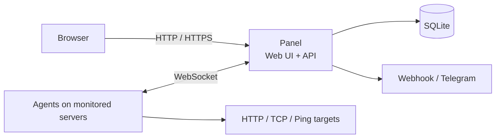

# Dingzi

[简体中文](README.md) | **English**

[](https://github.com/oarw/dingzi/actions/workflows/ci.yml)
[](https://github.com/oarw/dingzi/releases/latest)
[](https://go.dev/)
[](LICENSE)

A lightweight, self-hosted server monitoring dashboard. Connect multiple agents to one panel to track resource usage, traffic, service availability, and alerts.

Both the panel and agent are single binaries. The panel embeds its web interface and SQLite database support, so it needs no Node.js, external database, or Docker. The browser and agents share one server port, with HTTPS and WebSocket reverse proxy support.

**Single-binary deployment · One server port · Live and historical metrics · Separate admin interface · Chinese-language UI**

[Features](#features) · [Install the panel](#install-the-panel) · [Docker](#docker--compose) · [Install an agent](#install-an-agent) · [Platforms](#manual-installation-and-platforms) · [GitHub login](#github-login) · [FAQ](#faq)

## Features

- Live CPU, memory, disk, and network metrics with historical charts.
- Traffic billing cycles, quotas, and usage alerts.
- HTTP, TCP, and Ping checks with Webhook and Telegram notifications.
- A separate admin interface; the public page shows only machine names, online status, and resource usage percentages.
- A random initial admin password and optional GitHub login with an account allowlist.
- Automatic agent reconnection, individual credentials, and an opt-in web terminal.
- Linux installation, upgrades, and removal with systemd or OpenRC.
- Docker and Compose deployment for the panel, with amd64 and arm64 images.

| Capability | Details |
| --- | --- |
| Host metrics | CPU, memory, swap, disk, load, network speed, and cumulative traffic; connection counts and temperatures where supported |
| History | SQLite persistence and aggregation by time range; 30-day retention by default, configurable from 1 to 365 days |
| Traffic quotas | Count outbound traffic, inbound plus outbound, or the larger of the two; choose a monthly reset day in UTC |
| Service checks | Scheduled HTTP, TCP, and Ping checks with latency, availability, and recent results |
| Alerts | Rules for host metrics and service checks, Webhook/Telegram notifications, and an event log |
| Access control | Separate public and admin views; individual agent credentials, revoked when a machine is deleted |
| Web terminal | Unix PTY and terminal resizing; each agent must opt in, and the panel can disable terminals globally |
| Web interface | Light/dark themes, mobile layout, connection and stale-data indicators, with no external CDN dependency |

## How it works



Install an agent on each monitored host. Agents initiate connections to the panel, so they usually need no inbound ports. The panel handles aggregation, history, check scheduling, and alerts. Agents reconnect automatically; the panel keeps the last sample and marks disconnected or stale data.

Live samples use fixed-size memory buffers, while historical data is written to the database in batches. Web terminals use separate connections so terminal output does not compete with metric traffic on the same channel.

## Install the panel

### Linux installer

Run as root on Linux:

```sh
curl -fsSL https://raw.githubusercontent.com/oarw/dingzi/main/install-server.sh | sh
```

The installer downloads the latest stable release, verifies its SHA256 checksum, and sets up a service under a dedicated unprivileged user with startup at boot. The default port is `8008`: `http://<server-address>:8008/` is the public overview, and `/admin/` is the admin interface.

Read the initial admin password and agent registration secret from the service logs and store them securely:

```sh
# systemd
journalctl -u dingzi-server --no-pager -n 50
# OpenRC
tail -n 50 /var/log/dingzi-server.log
```

After signing in, customize the site name and public description in settings, then connect your first agent.

### Docker / Compose

The panel image is [`ghcr.io/oarw/dingzi`](https://github.com/oarw/dingzi/pkgs/container/dingzi), available for `linux/amd64` and `linux/arm64`. The `latest` tag follows stable releases; version tags such as `0.1.0` are also available.

Download [compose.yaml](compose.yaml) and start the panel:

```sh
mkdir -p dingzi && cd dingzi
curl -fsSL https://raw.githubusercontent.com/oarw/dingzi/main/compose.yaml -o compose.yaml
docker compose up -d
docker compose logs dingzi
```

By default, the panel is available locally at `http://127.0.0.1:8008/`, with administration at `/admin/`. The logs contain the initial password and registration secret. Configuration and SQLite data live in a named volume and survive container recreation. Compose enables a health check, a non-root user, a read-only root filesystem, and restricted privileges.

Set common options in a `.env` file next to `compose.yaml`, or as environment variables before the command:

| Variable | Default | Purpose |
| --- | --- | --- |
| `DINGZI_IMAGE` | `ghcr.io/oarw/dingzi:latest` | Pin an image version or use your own build |
| `DINGZI_BIND` | `127.0.0.1` | Host bind address; adjust to your network boundary when access from other hosts is needed |
| `DINGZI_PORT` | `8008` | Host port |
| `DINGZI_SECURE_COOKIE` | `false` | Set to `true` behind an HTTPS reverse proxy |

For example, pin a version and enable secure cookies:

```sh
DINGZI_IMAGE=ghcr.io/oarw/dingzi:0.1.0 DINGZI_SECURE_COOKIE=true docker compose up -d
```

See the next section for reverse proxy configuration. Agents still connect to your panel's domain. Install the agent binary on each monitored host to collect host metrics. The image runs the panel and requires no Docker socket, privileged mode, or host system-directory mounts.

You can also use Docker directly:

```sh
docker run -d --name dingzi --restart unless-stopped \
  --read-only --cap-drop ALL --security-opt no-new-privileges=true \
  --tmpfs /tmp:rw,size=16m --stop-timeout 30 \
  -p 127.0.0.1:8008:8008 -v dingzi_data:/data \
  ghcr.io/oarw/dingzi:0.1.0
docker logs dingzi
```

For a bind mount, create a data directory with access restricted to the container's UID/GID, `10001:10001`. Named volumes need no manual setup. To change OAuth settings, stop the service before editing `config.yaml` in the volume, and preserve existing secrets.

Back up the complete data directory before upgrading, then pull and recreate the container:

```sh
docker compose stop dingzi
docker compose cp dingzi:/data ./dingzi-backup
docker compose pull
docker compose up -d
```

`docker compose down` preserves named volumes. Do not use `down -v` on data you need. For a rollback, use the appropriate image version and a backup taken while the service was stopped.

### HTTPS reverse proxy

For public access, serve HTTPS through a reverse proxy and enable secure cookies:

```sh
curl -fsSL https://raw.githubusercontent.com/oarw/dingzi/main/install-server.sh | sh -s -- \
  --listen 127.0.0.1:8008 --secure-cookie
```

The proxy must support WebSocket and preserve the original `Host`. Example nginx configuration; replace the domain and certificate paths:

```nginx
# Place this map in the http block.
map $http_upgrade $connection_upgrade {
    default upgrade;
    ''      close;
}

server {
    listen 443 ssl;
    server_name panel.example.com;
    ssl_certificate     /path/to/fullchain.pem;
    ssl_certificate_key /path/to/privkey.pem;

    location / {
        proxy_pass http://127.0.0.1:8008;
        proxy_http_version 1.1;
        proxy_set_header Host $http_host;
        proxy_set_header Upgrade $http_upgrade;
        proxy_set_header Connection $connection_upgrade;
        proxy_set_header X-Forwarded-For $remote_addr;
        proxy_set_header X-Forwarded-Proto $scheme;
        proxy_read_timeout 90s;
    }
}
```

Login rate limits use the network address directly connected to the panel. Login requests through the same reverse proxy share a rate-limit budget.

You can separately configure HTTP-to-HTTPS redirects. If the proxy runs on another host, replace the loopback listen address above with one appropriate for your network and firewall.

### File locations

| Content | Default installer location |
| --- | --- |
| Panel binary | `/usr/local/bin/dingzi-server` |
| Panel configuration and database | `/var/lib/dingzi/` |
| Panel options saved by the installer | `/etc/dingzi/server.conf` |
| Agent binary | `/usr/local/bin/dingzi-agent` |
| Agent configuration and identity credentials | `/etc/dingzi/agent.yaml` |

The installer uses `server.conf` to preserve options between runs. Editing it does not change an existing service's startup arguments; rerun the installer to apply the options.

## Install an agent

Run as root on each Linux host you want to monitor, replacing the address and secret:

```sh
curl -fsSL https://raw.githubusercontent.com/oarw/dingzi/main/install.sh | sh -s -- \
  --server https://panel.example.com --secret 'YOUR_AGENT_SECRET'
```

Agent configuration is saved in `/etc/dingzi/agent.yaml`, including an automatically generated UUID and individual credentials. Do not copy this identity file to other machines. See the [agent configuration example](agent.example.yaml) for more options.

Once connected, use the admin interface to rename machines and set traffic quotas and reset days. The registration secret is used only to enroll a new identity; subsequent connections use individual credentials. Rotating the registration secret does not disconnect enrolled agents. Deleting a machine permanently revokes its identity.

```sh
# Check agent status (systemd)
systemctl status dingzi-agent
journalctl -u dingzi-agent --no-pager -n 50

# OpenRC
rc-service dingzi-agent status
tail -n 50 /var/log/dingzi-agent.log
```

Web terminals are disabled by default on agents. Add `--allow-terminal` when needed; the panel must also allow terminals. A terminal runs with the agent process's permissions. Web terminals are not available on Windows.

## Manual installation and platforms

Download the appropriate binary from [Releases](https://github.com/oarw/dingzi/releases/latest), verify its SHA256 against `checksums.txt` from the same release, and run it:

```sh
./dingzi-server --listen 127.0.0.1:8008 --data ./data
./dingzi-agent --config ./agent.yaml --server https://panel.example.com --secret 'YOUR_AGENT_SECRET'
```

Use the corresponding `.exe` files on Windows. On first startup, the panel creates its configuration and displays the admin password.

| System | Release architectures |
| --- | --- |
| Linux | amd64, arm64, arm (ARMv6/v7), 386, riscv64 |
| Windows | amd64 |
| macOS | amd64, arm64 |
| FreeBSD | amd64 |

Linux binaries do not depend on glibc and can run on Alpine. The installers support systemd and OpenRC; run the binaries manually on other systems. LXC/OpenVZ metrics depend on what the host exposes. Dedicated container quota collection is not implemented, so displayed values may not match your container's allocation. All release targets are checked by cross-compilation; they have not all been tested on physical target systems.

There is no Windows ARM64 release binary yet. ICMP, temperature, and connection-count support depend on system permissions and the host environment.

## Configuration and usage

Persistent panel settings live in `config.yaml` inside the data directory. The file is generated on first startup; do not overwrite existing credentials with an example file.

Common startup options:

| Option | Default | Purpose |
| --- | --- | --- |
| `--listen` | `:8008` | HTTP listen address |
| `--data` | `./data` | Configuration and database directory for manual runs |
| `--interval` | `1` | Agent sampling interval in seconds, from 0.5 to 30 |
| `--retention-days` | `30` | History retention in days, from 1 to 365 |
| `--secure-cookie` | `false` | Enable for HTTPS deployments |
| `--terminal` | `true` | Global panel terminal switch; agents must still opt in individually |

Run the binary with `--help` for the complete option list. The installed panel service uses `/var/lib/dingzi` as its data directory.

### Add checks and notifications

1. Create an HTTP, TCP, or Ping check in the admin interface. Select the agent that will run it, the target, interval, and timeout.
2. Add a Webhook or Telegram notification channel and use the test function to confirm delivery.
3. Create an alert rule for a check or host metric, choosing a threshold and notification channel.
4. Review firing, recovery, and notification delivery results in the event log.

Service checks originate from the selected agent and reflect its network view. Webhook and Telegram notifications originate from the panel. Check targets need not be publicly reachable, but they must be reachable from the selected agent.

## GitHub login

Password login remains available. To enable GitHub login, create your own OAuth App with a callback URL of `https://panel.example.com/auth/github/callback`.

Stop the panel and back up its data directory. Add the following to the panel's `config.yaml`, preserving existing secrets and the password hash:

```yaml
github:
  client_id: YOUR_CLIENT_ID
  client_secret: YOUR_CLIENT_SECRET
  callback_url: https://panel.example.com/auth/github/callback
  allowed_user_ids: [12345678]
```

Replace the domain, app credentials, and GitHub **numeric user ID**. Find your numeric ID in the `id` field at `https://api.github.com/users/YOUR_USERNAME`. Only allowlisted accounts can sign in; there is no open registration. Enable `--secure-cookie` for HTTPS and restart the panel after changing configuration. See the [panel configuration example](config.example.yaml).

If you forget the admin password, stop the service, back up the configuration, clear only `password_hash`, and restart. Read the new password from the logs. Do not delete `agent_secret` or the database.

## Upgrades and backups

Before upgrading, stop the panel and back up the entire data directory, then rerun the installer. The installer preserves data and options you have not explicitly overridden. Use `--version v0.1.0` to select a version or `--uninstall` to remove the service while keeping data. Do not back up only the main SQLite file while writes are in progress.

```sh
# Install a specific panel version
curl -fsSL https://raw.githubusercontent.com/oarw/dingzi/main/install-server.sh | sh -s -- \
  --version v0.1.0

# Remove the panel service, keeping data
curl -fsSL https://raw.githubusercontent.com/oarw/dingzi/main/install-server.sh | sh -s -- --uninstall
```

The installer does not automatically roll back the database on failure. Check format compatibility before downgrading and restore a backup taken while stopped if necessary. When moving hosts, copy the complete panel data directory and preserve each agent's own identity file. Use the same stable release for the panel and agents where possible.

## FAQ

<details>
<summary>The agent installed successfully. Why does it not appear online?</summary>

Start with the `dingzi-agent` logs. Check the panel URL, registration secret, and reverse proxy WebSocket support. `https://` and `wss://` verify TLS certificates; `http://` and `ws://` are unencrypted. A bare domain is treated as HTTPS. If the identity has been revoked, the old UUID cannot re-enroll using the registration secret; register a new machine identity.

</details>

<details>
<summary>Why is the web terminal unavailable after I sign in?</summary>

You must be signed in as an administrator, the panel must allow terminals, the machine must be online, and its agent must have `--allow-terminal` enabled. Non-Unix platforms such as Windows do not provide a PTY terminal. Terminal permissions match the agent process, so enable this only on machines that need remote administration.

</details>

<details>
<summary>Why do container memory or disk metrics differ from my purchased quota?</summary>

The kernel may expose host data to the container. This version does not implement dedicated LXC/OpenVZ CPU, memory, or disk quota reading. The `mounts` option selects filesystems to measure, but does not replace a host quota interface.

</details>

<details>
<summary>Are GitHub login or third-party CDNs required?</summary>

No. Admin password login is always available, and the GitHub login option is hidden when OAuth is not configured. Web assets are embedded in the panel binary and need no external CDN at runtime. Check targets, notification services, and OAuth, when enabled, still need their respective network connections.

</details>

<details>
<summary>How do I deploy on Docker, Windows, or macOS?</summary>

The panel provides Docker/Compose deployment and Linux systemd/OpenRC installers. On Windows and macOS, run the appropriate binaries manually. Windows service and macOS launchd installers are not provided yet.

</details>

## Build from source

Build with a supported Go version. Releases currently use Go 1.27.1; the minimum language version is Go 1.25:

```sh
go build -o dingzi-server ./cmd/server
go build -o dingzi-agent ./cmd/agent
go test ./...
```

Web assets are embedded and require no frontend build. Set `CGO_ENABLED=0` to build without a C toolchain; the race detector separately requires a C compiler:

```sh
go vet ./...
go test -race ./...
node --test e2e/board_test.mjs
```

`cmd/server` and `cmd/agent` contain the entry points. `internal/server` contains the panel and embedded web interface, `internal/agent` contains collection and check execution, `internal/proto` defines the shared protocol, and `e2e` contains regression checks.

Build a local image and use the same Compose configuration:

```sh
docker build --build-arg VERSION=dev -t dingzi:local .
DINGZI_IMAGE=dingzi:local docker compose up -d
```

CI verifies container health, login, configuration/database persistence, and clean shutdown on native amd64 and arm64 hosts. Releases call the Docker workflow to publish both architectures, provenance, and an SBOM, then verify anonymous pulls before publishing binaries. Maintainers must ensure a new GHCR package is public on its first publication; later versions publish automatically. The Docker workflow also supports rebuilding an existing stable release tag.

## Contributing

[Issues](https://github.com/oarw/dingzi/issues) and pull requests are welcome. Include the version, system, deployment method, reproduction steps, and redacted logs in bug reports. Never upload passwords, registration secrets, individual agent credentials, or OAuth secrets.

See the [contribution guide](CONTRIBUTING.en.md) for development and verification, and the [maintenance guide](MAINTAINING.en.md) for module boundaries, source-size limits, secure coding, and releases. Run relevant tests, formatting, and structure checks before submitting code. Include regression cases for access control, persistence, or protocol changes.

## License

[AGPL-3.0-or-later](LICENSE). Bundled third-party web components retain their respective licenses.
