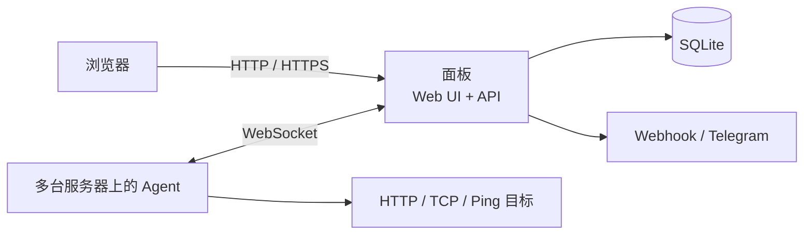

# Dingzi 钉子

**简体中文** | [English](README.en.md)

[](https://github.com/oarw/dingzi/actions/workflows/ci.yml)
[](https://github.com/oarw/dingzi/releases/latest)
[](https://go.dev/)
[](LICENSE)

轻量、自托管的服务器监控面板。一个面板连接多台探针，集中查看资源占用、流量、服务可用性和告警。

面板与探针均为单文件程序。面板内置网页和 SQLite，无需 Node.js、外部数据库或 Docker；网页与探针通信共用一个端口，支持 HTTPS / WebSocket 反向代理。

**单文件部署 · 单端口通信 · 实时与历史指标 · 独立管理后台 · 中文界面**

[功能](#功能) · [安装面板](#安装面板) · [Docker](#docker--compose) · [接入探针](#agent-端一键安装) · [平台支持](#手动运行与平台) · [GitHub 登录](#github-登录) · [常见问题](#常见问题)

## 功能

- 实时 CPU、内存、磁盘、网络指标与历史图表。
- 流量账期、配额和超额提醒。
- HTTP / TCP / Ping 服务监控，Webhook / Telegram 告警通知。
- 独立管理后台；公开首页仅展示机器名称、在线状态及资源使用率。
- 随机管理员密码，可选 GitHub 账号白名单登录。
- 探针自动重连、独立身份凭证；按需开启网页终端。
- Linux systemd / OpenRC 一键安装、升级和卸载。
- Docker / Compose 面板部署，提供 amd64、arm64 镜像。

| 能力 | 说明 |
| --- | --- |
| 主机指标 | CPU、内存、swap、磁盘、负载、网速、累计流量；系统支持时显示连接数与温度 |
| 历史数据 | SQLite 持久化，按时间范围聚合；默认保留 30 天，可设置 1–365 天 |
| 流量配额 | 按上传、上下行之和或两者较大值计费，自定义 UTC 账期归零日 |
| 服务监控 | 定时 HTTP、TCP、Ping 检查，可查看响应时间、可用率与最近结果 |
| 告警 | 按规则判断主机或监控状态，通过 Webhook / Telegram 通知，并保留事件记录 |
| 访问控制 | 公开概览与后台分离；探针使用独立凭证，删除机器会吊销其身份 |
| 网页终端 | 支持 Unix PTY、窗口缩放；每台探针单独授权，面板可统一关闭 |
| 网页界面 | 深浅主题、移动端布局、连接状态与数据过期提示，无外部 CDN 依赖 |

## 工作方式



每台被监控主机安装一个 Agent，主动连接面板；通常无需向探针主机开放入站端口。
面板负责汇总、历史存储、监控调度与告警。Agent 断线后自动重连，面板保留最后一次采样并标明离线或数据过期状态。

实时采样在内存中使用固定长度缓冲，历史数据批量写入数据库。网页终端使用独立连接，避免大量终端输出挤占指标通道。

## 安装面板

### Linux 一键安装

在 Linux 上以 root 执行：

```sh
curl -fsSL https://raw.githubusercontent.com/oarw/dingzi/main/install-server.sh | sh
```

安装器下载最新正式版并校验 SHA256，以独立低权限用户运行面板，配置开机启动。
默认端口为 `8008`：`http://<服务器地址>:8008/` 是公开概览，`/admin/` 是管理后台。
首次管理员密码和探针注册密钥可从服务日志读取，请妥善保存：

```sh
# systemd
journalctl -u dingzi-server --no-pager -n 50
# OpenRC
tail -n 50 /var/log/dingzi-server.log
```

首次登录后，可以在设置中修改站点名称和首页说明，再接入第一台探针。

### Docker / Compose

面板镜像为 [`ghcr.io/oarw/dingzi`](https://github.com/oarw/dingzi/pkgs/container/dingzi)，支持 `linux/amd64` 和 `linux/arm64`。
`latest` 跟随最新正式版，也可使用 `0.1.0` 等版本标签。

下载 [compose.yaml](compose.yaml) 并启动：

```sh
mkdir -p dingzi && cd dingzi
curl -fsSL https://raw.githubusercontent.com/oarw/dingzi/main/compose.yaml -o compose.yaml
docker compose up -d
docker compose logs dingzi
```

默认在本机 `http://127.0.0.1:8008/` 提供服务，`/admin/` 为后台；首次密码和注册密钥见日志。
配置与 SQLite 保存在命名卷中，重建容器会保留数据。Compose 默认启用健康检查、非 root 用户、只读根目录和权限限制。

可通过同目录的 `.env` 或命令前的环境变量修改常用选项：

| 变量 | 默认值 | 用途 |
| --- | --- | --- |
| `DINGZI_IMAGE` | `ghcr.io/oarw/dingzi:latest` | 固定镜像版本或使用自行构建的镜像 |
| `DINGZI_BIND` | `127.0.0.1` | 宿主机绑定地址；需要其他主机访问时按部署边界设置 |
| `DINGZI_PORT` | `8008` | 宿主机端口 |
| `DINGZI_SECURE_COOKIE` | `false` | HTTPS 反代部署时设为 `true` |

例如固定版本并启用 HTTPS Cookie：

```sh
DINGZI_IMAGE=ghcr.io/oarw/dingzi:0.1.0 DINGZI_SECURE_COOKIE=true docker compose up -d
```

反向代理配置见下一节。探针仍连接你的面板域名；建议在被监控主机上安装 Agent 单文件程序，以采集宿主机指标。
本镜像运行面板，不需要 Docker Socket、特权容器或宿主机系统目录挂载。

也可以直接使用 Docker：

```sh
docker run -d --name dingzi --restart unless-stopped \
  --read-only --cap-drop ALL --security-opt no-new-privileges=true \
  --tmpfs /tmp:rw,size=16m --stop-timeout 30 \
  -p 127.0.0.1:8008:8008 -v dingzi_data:/data \
  ghcr.io/oarw/dingzi:0.1.0
docker logs dingzi
```

使用宿主机目录绑定挂载时，先创建只允许容器 UID/GID `10001:10001` 访问的数据目录；命名卷无需这一步。
更改 OAuth 配置前先停止服务，再编辑卷中的 `config.yaml`，保留原有密钥。

升级前备份完整数据目录，随后拉取镜像并重建：

```sh
docker compose stop dingzi
docker compose cp dingzi:/data ./dingzi-backup
docker compose pull
docker compose up -d
```

`docker compose down` 保留命名卷；不要使用 `down -v` 删除正在使用的数据。需要回退时使用对应版本镜像和停机备份。

### HTTPS 反向代理

公网使用时，通过反向代理提供 HTTPS，并启用安全 Cookie：

```sh
curl -fsSL https://raw.githubusercontent.com/oarw/dingzi/main/install-server.sh | sh -s -- \
  --listen 127.0.0.1:8008 --secure-cookie
```

代理需要支持 WebSocket，保留原始 `Host`。nginx 示例（替换域名和证书路径）：

```nginx
# 放在 http 块中
map $http_upgrade $connection_upgrade {
    default upgrade;
    ''      close;
}

server {
    listen 443 ssl;
    server_name panel.example.com;
    ssl_certificate     /path/to/fullchain.pem;
    ssl_certificate_key /path/to/privkey.pem;

    location / {
        proxy_pass http://127.0.0.1:8008;
        proxy_http_version 1.1;
        proxy_set_header Host $http_host;
        proxy_set_header Upgrade $http_upgrade;
        proxy_set_header Connection $connection_upgrade;
        proxy_set_header X-Forwarded-For $remote_addr;
        proxy_set_header X-Forwarded-Proto $scheme;
        proxy_read_timeout 90s;
    }
}
```

登录限流按直接连接面板的网络地址计算，同一反向代理后的登录请求共享限流额度。

可另行配置 HTTP 到 HTTPS 的跳转。未使用同机代理时，不要设置上述回环监听地址；请按网络边界设置监听地址和防火墙。

### 文件位置

| 内容 | 一键安装的默认位置 |
| --- | --- |
| 面板程序 | `/usr/local/bin/dingzi-server` |
| 面板配置、数据库 | `/var/lib/dingzi/` |
| 安装器保存的面板选项 | `/etc/dingzi/server.conf` |
| 探针程序 | `/usr/local/bin/dingzi-agent` |
| 探针配置与身份凭证 | `/etc/dingzi/agent.yaml` |

`server.conf` 用于安装器继承选项；直接编辑它不会改写已经生成的服务启动参数，应重新运行安装命令应用选项。

## Agent 端一键安装

在需要监控的 Linux 主机上以 root 执行，将地址和密钥替换为自己的：

```sh
curl -fsSL https://raw.githubusercontent.com/oarw/dingzi/main/install.sh | sh -s -- \
  --server https://panel.example.com --secret 'YOUR_AGENT_SECRET'
```

探针配置保存在 `/etc/dingzi/agent.yaml`，包括自动生成的 UUID 和单机凭证。不要把这份身份配置复制给其他机器。更多选项见 [探针配置示例](agent.example.yaml)。

接入后，进入后台为机器改名、设置流量配额与归零日。注册密钥只用于新身份首次接入，后续连接使用单机凭证。
轮换注册密钥不会让已绑定探针离线；删除机器则会永久吊销该身份。

```sh
# 查看探针运行状态（systemd）
systemctl status dingzi-agent
journalctl -u dingzi-agent --no-pager -n 50

# OpenRC
rc-service dingzi-agent status
tail -n 50 /var/log/dingzi-agent.log
```

网页终端默认在探针侧关闭。需要时添加 `--allow-terminal`；终端以探针运行用户的权限执行，面板也必须允许此功能。Windows 不提供网页终端。

## 手动运行与平台

从 [Releases](https://github.com/oarw/dingzi/releases/latest) 下载对应程序，按同版本 `checksums.txt` 校验 SHA256 后运行：

```sh
./dingzi-server --listen 127.0.0.1:8008 --data ./data
./dingzi-agent --config ./agent.yaml --server https://panel.example.com --secret 'YOUR_AGENT_SECRET'
```

Windows 使用对应的 `.exe` 文件。面板首次启动会生成配置并显示管理员密码。

| 系统 | 发布架构 |
| --- | --- |
| Linux | amd64、arm64、arm（ARMv6/v7）、386、riscv64 |
| Windows | amd64 |
| macOS | amd64、arm64 |
| FreeBSD | amd64 |

Linux 程序不依赖 glibc，可用于 Alpine；一键安装仅适用于 systemd / OpenRC。其他系统手动运行。LXC / OpenVZ 的指标取决于宿主机开放的数据，尚未实现专用容器配额采集；不要将显示值直接等同于容器额度。各架构发布包经过编译检查，不代表全部经过实机验收。

Windows 暂无 ARM64 发布包。ICMP、温度与连接数等指标受系统权限和宿主环境影响。

## 配置与使用

面板的持久配置位于数据目录中的 `config.yaml`；初次启动自动生成，请勿直接用示例覆盖已有凭据。
常用启动参数：

| 参数 | 默认值 | 用途 |
| --- | --- | --- |
| `--listen` | `:8008` | HTTP 监听地址 |
| `--data` | `./data` | 配置与数据库目录，手动运行时使用 |
| `--interval` | `1` | Agent 采样间隔（秒），范围 0.5–30 |
| `--retention-days` | `30` | 历史数据保留天数，范围 1–365 |
| `--secure-cookie` | `false` | HTTPS 部署时启用 |
| `--terminal` | `true` | 面板终端总开关；Agent 仍需单独开启 |

完整选项以程序 `--help` 为准。一键安装服务使用 `/var/lib/dingzi` 作为数据目录。

### 添加监控和通知

1. 在后台的服务监控页新建 HTTP、TCP 或 Ping 监控，指定执行检查的机器、目标、间隔和超时。
2. 在通知渠道页添加 Webhook 或 Telegram。使用测试功能确认渠道可达。
3. 新建告警规则，选择监控或主机指标、阈值及通知渠道。
4. 在事件记录中查看触发、恢复和通知发送结果。

监控请求从所选 Agent 发出，反映它看到的网络状态；Webhook / Telegram 通知从面板发出。
因此目标不必能从公网访问，但必须能从相应执行机器访问。

## GitHub 登录

密码登录始终可用。启用 GitHub 登录时，先创建自己的 OAuth App，回调地址为 `https://panel.example.com/auth/github/callback`。

停止面板并备份数据目录，在面板 `config.yaml` 中追加以下配置，保留原有密钥与密码哈希：

```yaml
github:
  client_id: YOUR_CLIENT_ID
  client_secret: YOUR_CLIENT_SECRET
  callback_url: https://panel.example.com/auth/github/callback
  allowed_user_ids: [12345678]
```

用自己的域名、App 凭据和 GitHub **数字用户 ID** 替换示例；数字 ID 可从 `https://api.github.com/users/YOUR_USERNAME` 的 `id` 字段获取。只有白名单内的账号能登录，不开放注册。HTTPS 部署须开启 `--secure-cookie`，配置修改后重启生效。详见 [面板配置示例](config.example.yaml)。

忘记管理员密码时，停止服务、备份配置，仅清空 `password_hash`，重启后从日志获取新密码。不要删除 `agent_secret` 或数据库。

## 升级与备份

升级前停止面板并备份整个数据目录，再重新运行安装命令。安装器保留数据和未显式覆盖的设置；`--version v0.1.0` 可指定版本，`--uninstall` 卸载服务并保留数据。不要只复制正在写入的 SQLite 主文件。

```sh
# 安装指定面板版本
curl -fsSL https://raw.githubusercontent.com/oarw/dingzi/main/install-server.sh | sh -s -- \
  --version v0.1.0

# 卸载面板服务，保留数据
curl -fsSL https://raw.githubusercontent.com/oarw/dingzi/main/install-server.sh | sh -s -- --uninstall
```

安装器失败时不会自动回滚数据库。降级前应确认格式兼容，必要时恢复停机备份。
迁移主机时复制完整面板数据目录，并保留各探针自己的身份文件；面板与探针建议使用同一正式版本。

## 常见问题

<details>
<summary>探针安装成功，为什么面板没有显示在线？</summary>

先查看 `dingzi-agent` 日志。检查面板地址、注册密钥及反向代理的 WebSocket 支持。
`https://` / `wss://` 会校验 TLS 证书；`http://` / `ws://` 使用明文连接。裸域名按 HTTPS 处理。
如果日志提示身份已吊销，旧 UUID 不能再使用注册密钥冒用接入，需要按新主机身份重新注册。

</details>

<details>
<summary>为什么登录后仍看不到网页终端？</summary>

需要同时满足管理员登录、面板允许终端、机器在线以及该 Agent 已设置 `--allow-terminal`。
Windows 等非 Unix 平台不提供 PTY 终端。终端权限等同于 Agent 进程权限，请仅对需要远程维护的机器开启。

</details>

<details>
<summary>容器内的内存或磁盘数据与购买的配额不同？</summary>

内核可能向容器暴露宿主机数据。本版本尚未实现 LXC / OpenVZ 专用 CPU、内存和磁盘配额读取。
可用 `mounts` 指定需要统计的文件系统，但它不能代替宿主机配额接口。

</details>

<details>
<summary>必须使用 GitHub 登录吗？是否需要第三方 CDN？</summary>

不需要。管理员密码登录始终可用；未配置 OAuth 时不会显示 GitHub 入口。
网页资源随面板程序内嵌，运行时不依赖外部 CDN。监控目标、通知渠道以及启用的 OAuth 服务需要相应网络连接。

</details>

<details>
<summary>容器、Windows 和 macOS 分别怎样部署？</summary>

面板提供 Docker / Compose 部署及 Linux systemd / OpenRC 安装脚本。Windows 和 macOS 可手动运行对应单文件程序；尚未提供 Windows 服务或 macOS launchd 安装器。

</details>

## 从源码构建

使用受支持的 Go 版本构建；正式发布使用 Go 1.27.1，源码语言最低要求为 Go 1.25：

```sh
go build -o dingzi-server ./cmd/server
go build -o dingzi-agent ./cmd/agent
go test ./...
```

网页资源已内嵌，无前端构建步骤。无 C 工具链部署可设置 `CGO_ENABLED=0` 构建；race 检测另需 C 编译器：

```sh
go vet ./...
go test -race ./...
node --test e2e/board_test.mjs
```

源码目录：`cmd/server` 与 `cmd/agent` 为程序入口，`internal/server` 为面板和内嵌网页，
`internal/agent` 为采集及检查逻辑，`internal/proto` 为双方协议，`e2e` 为回归验证。

本地构建镜像并使用同一份 Compose 配置：

```sh
docker build --build-arg VERSION=dev -t dingzi:local .
DINGZI_IMAGE=dingzi:local docker compose up -d
```

CI 在 amd64、arm64 原生机器上验证容器健康、登录、配置/数据库持久化和正常退出。
正式发布调用 Docker workflow 构建双架构镜像、生成来源证明与 SBOM，并验证匿名拉取后再发布二进制。
维护者首次发布 GHCR 包时需将包可见性设为 Public；后续版本自动发布。Docker workflow 也支持按已发布的正式版本标签重建镜像。

## 参与贡献

欢迎提交 [Issue](https://github.com/oarw/dingzi/issues) 或 Pull Request。报告问题时请附版本、系统、部署方式、复现步骤和脱敏日志；不要上传密码、注册密钥、单机凭证或 OAuth Secret。

开发与验证步骤见 [贡献指南](CONTRIBUTING.md)；模块边界、文件规模、安全编码和发布流程见 [维护指南](MAINTAINING.md)。
提交代码前运行相关测试、格式与结构检查。涉及访问控制、数据持久化或协议的改动，请同时提供回归用例。

## 许可证

[AGPL-3.0-or-later](LICENSE)。所含第三方网页组件保留各自的许可证。
